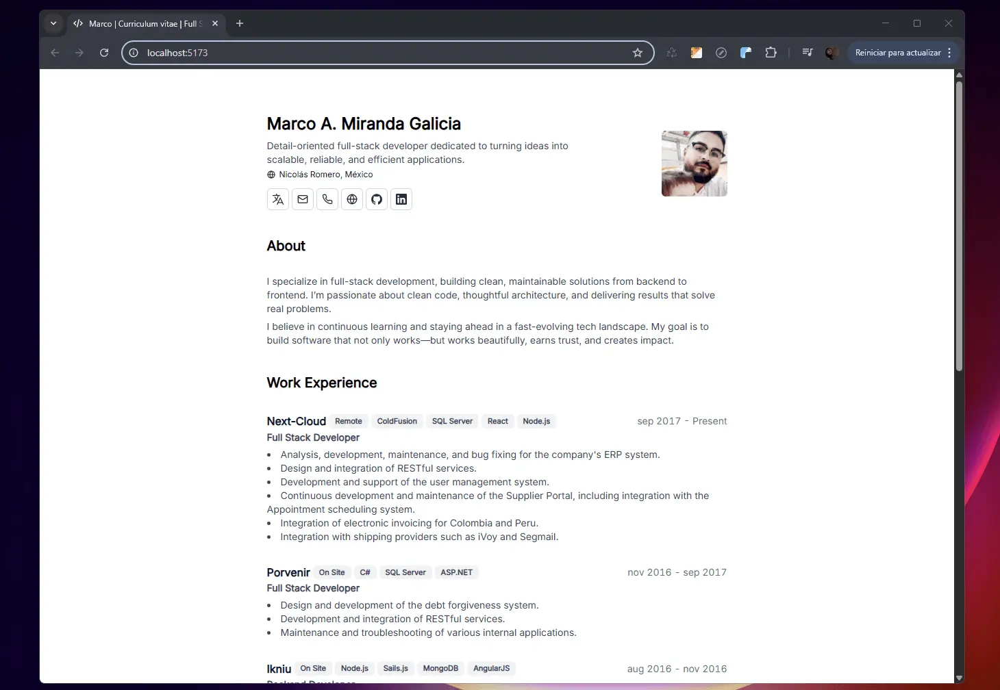

<div align="center">
<h2>
    Curriculum vitae
</h2>
</div>

</img>

A minimalist, print-friendly curriculum vitae that can be configured with a single JSON file.

## 🛠️ Stack

- [**Vite**](https://vite.dev/) - It is a development tool that seeks to provide a faster and more efficient development experience for modern web projects.
- [**React**](https://react.dev/) - The library for web and native user interfaces.
- [**Tailwind CSS**](https://tailwindcss.com/) - Open-source CSS framework for web design.

## 🚀 Usage

1. Clone the [repository](https://github.com/mmarcode/curriculum-vitae)
2. Run ```npm install``` to rebuild node modules
3. Run ```npm run dev```

## 🧞 Commands

|     | Command          | Action                                        |
| :-- | :--------------- | :-------------------------------------------- |
| ⚙️  | `dev`           | Launch a local development server on  `localhost:4321`.  |
| ⚙️  | `build`          | Checks for possible errors and makes production packaging in `./dist/`.      |
| ⚙️  | `preview`        | Local Preview `localhost:4321` |

## 🐙 Contributing

Pull requests are welcome. For major changes, please open an issue first
to discuss what you would like to change.

Please make sure to update tests as appropriate.


## 🔑 License

[MIT](LICENSE.txt) - Creado por [**mmarcode**](https://mmarcode.vercel.app/).